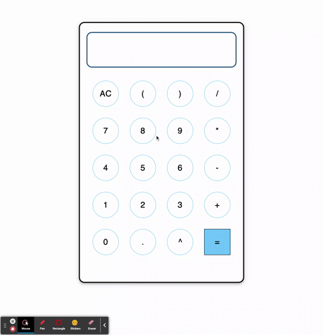
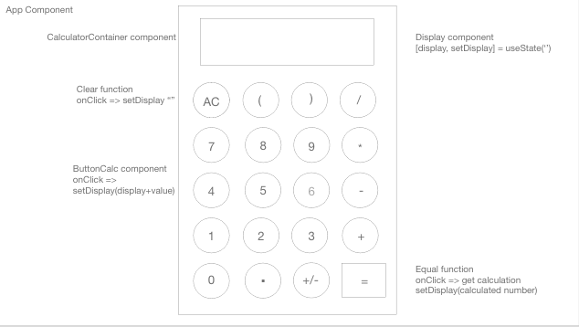
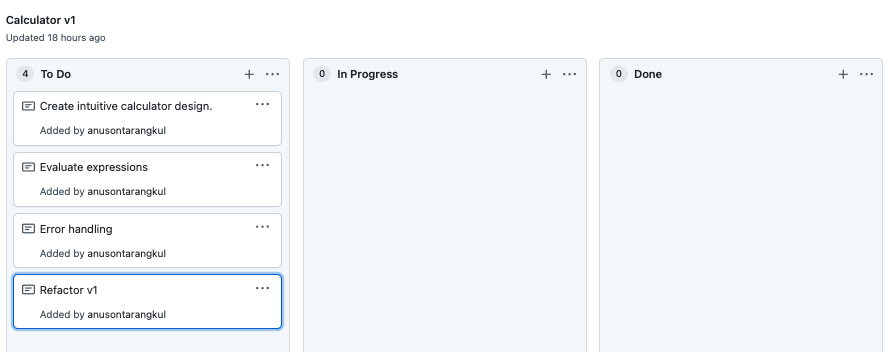
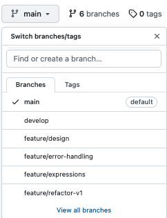

# Calculator

A calculator app built on React. .



## Table of Contents

|                                         |                                         |                                             |
| :-------------------------------------: | :-------------------------------------: | :-----------------------------------------: |
|       [Introduction](#calculator)       | [Table of Contents](#table-of-contents) | [Development Process](#development-process) |
|             [Tests](#tests)             |        [Deployment](#deployment)        |    [Code Hightlights](#code-highlights)     |
| [Technologies Used](#Technologies-Used) |           [Credits](#Credits)           |             [License](#License)             |

## Development Process

1. Created Mockup in Adobe XD.



2. Used GitHub Projects and Branches to organize work flow.





3. Development

The three main components are CalculatorContainer, ButtonCalc, and Display. The CalculatorContainer is the the parent component that holds the state for the other 2. The Display component renders the value of the input and calculation to display. The ButtonCalc sets the display with onclick button that adds to the display, clears the display, or calculates it.

There are two functions for error handling. One is `consecutiveOperatorError`, which prevents the user from entering an additional operator if the user's last entry was an operator. The other is `consecutiveDecimalError`, which prevents the user from entering an additional decimal if the user's last entry was an decimal.

This error handling doesn't prevent all the possible invalid entries the user can made. If the calculation expression has an error, the display will display empty.

4. Expressions

## Tests

Unit tests and integration tests were created.

```
npm test
```

## Deployment

[Deployed](https://calculator-react1.netlify.app/) using netlify.

## Code Highlights

When the user clicks on an operator to prevent errors, the code checks to see if the previous character was an operator. If it did, it returns true and prevents the user from entering the operator. Otherwise, the calculator proceeds as normal.

```JavaScript
  const consecutiveOperatorError = (expression) => {
    const lastChar = expression[expression.length - 1];
    if (
      lastChar === '/' ||
      lastChar === '*' ||
      lastChar === '+' ||
      lastChar === '-' ||
      lastChar === '^'
    ) {
      return true;
    } else {
      return false;
    }
  };
```

Used custom JavaScript function to calculate expression to avoid using eval(). If there, is an error in the calculation, the display will be set to empty. A reggex is used to convert `^` to `**` so JavaScript can calculate exponents.

```JavaScript
  const calculateNum = (expression) => {
    try {
      const updatedExpression = expression.replace('^', '**');

      const evaluatedNum = Function(
        `'use strict'; return (${updatedExpression})`
      )();
      setDisplayValue(evaluatedNum);
    } catch (error) {
      setDisplayValue('');
    }
  };
```

## Technologies Used

### Front End Library

- [React](https://reactjs.org/)

### UI Library

- [MUI](https://mui.com/)

### Testing

- [react-testing-library](https://reactjs.org/docs/testing.html)

## Credits

|                           |                                                                                                                                                                                                       |
| ------------------------- | ----------------------------------------------------------------------------------------------------------------------------------------------------------------------------------------------------- |
| **David Anusontarangkul** | [ LinkedIn](https://www.linkedin.com/in/anusontarangkul/) [ GitHub](https://github.com/anusontarangkul) |

## License

[](https://opensource.org/licenses/
